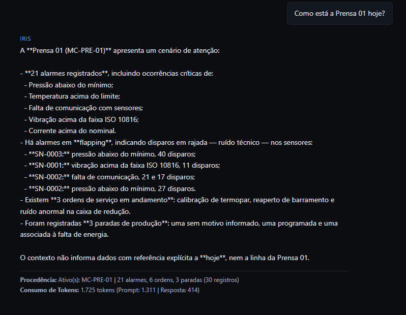
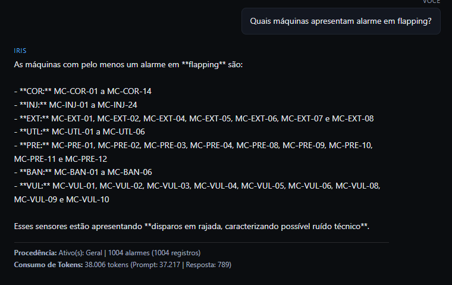
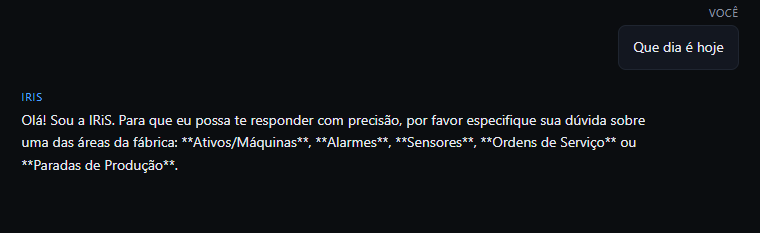

# Relatório Técnico

## 1 Funcionamento da Arquitetura:

### Interface e Cliente (Frontend): 
A conversa é gerenciada pelo Chat.tsx e renderizada pelo Mensagem.tsx. As chamadas HTTP são centralizadas no api.ts.

### API e Roteamento (Backend): 
O servidor Express (server/index.js) recebe as requisições na rota POST /api/chat e repassa a mensagem do usuário para a camada do orquestrador.

### Seleção e Sanitização Local:
O orquestrador.js identifica a intenção da pergunta. Em seguida, aciona os sanitizadores específicos para tratar inconsistências e sanitizar a base antes de tocá-la em serviços externos.

### Serialização Compacta (conversão de JSON para texto):
Em vez de enviar objetos JSON com chaves e aspas repetitivas, os dados pré-processados são convertidos em linhas de texto simples. Assim, reduzindo drasticamente o número de tokens.

### Integração com LLM e Transparência:
A chamada à API da OpenAI gera a resposta e retorna a medição exata de tokens.

--- 

## 2. Inconsistências Encontradas nos Dados Brutos

### alarmes.json:
- Flapping: Identificados 393 alarmes apresentando disparos consecutivos em rajada num curto intervalo de tempo (ruído de sensor).

- Inconsistência Temporal: 45 registros com data de abertura posterior à data de fechamento.

- Inconsistência de Chaves: Mistura de IDs internos (AT-0012) com códigos de catálogo (MC-INJ-19), corrigida via mapa De-Para.

### ativos.json:
- Sujeiras de formatação em strings e tags de máquinas desalinhadas com o padrão da fábrica.

### ordens.json: 
- Custos numéricos representados de forma inconsistente (strings formatadas com vírgula vs. floats) e divergências nos formatos de data (ISO 8601 vs. formato brasileiro DD/MM/YYYY).

### paradas.json: 
- Tipagem inconsistente no campo programada (mistura de booleans, strings "true" e inteiros 0/1) e falta de padronização nos nomes dos turnos (Turno A, A, 1).

### sensores.json: 
- Unidades de medida despadronizadas para a mesma grandeza física (°C, Celsius, C) e ligeiras alterações nas chaves do schema.

---

## 3. Medição e Comparativo de Consumo de Tokens: 

### Métrica de Tokens:
- alarmes.json bruto: 721.611 tokens

- Otimizados: 1.642 tokens

### Comparativo de Custo Financeiro em Dólares 
- Tabela de preços de referência do modelo GPT-5.6 Luna: US$ 0,20 por 1 Milhão de tokens de entrada / US$ 1,20 por 1 Milhão de tokens de saída.

- Custo com Dados Crus:  
Entrada:    US$ 0.144227
Saída:      US$ 0.000574
TOTAL CRU:  US$ 0.144800 

- Custo com Dados Otimizados:  
Entrada:            US$ 0.000262
Saída:              US$ 0.000397
TOTAL OTIMIZADO:    US$ 0.000659 

### Justificativa Técnica
- A quantidade de consumo de token foi reduzida de aproximadamente 720 mil tokens para 1311 tokens procurando manter a qualidade das respostas do agente. Assim, diminindo o custo financeiro ao se utilizar a API da OpenAI sem comprometer a respota. 

É devido ao baixo custo junto com o retorno do agente que este número se encontra de acordo.

- Para reduzir novamente o consumo de tokens. Outra abordagem que tomareia seria reduzir a quantidade de registros que são enviados pela API. Atualmente, ao se perguntar sobre a prensa 01, a IA acessa 30 registros. Então isso seria reduzido para 10, assim diminuindo a quantidade de informações que são enviadas.

---

## 4 Print de comunicação com Agente
- Print 1:

- Print 2:

- Print 3:

